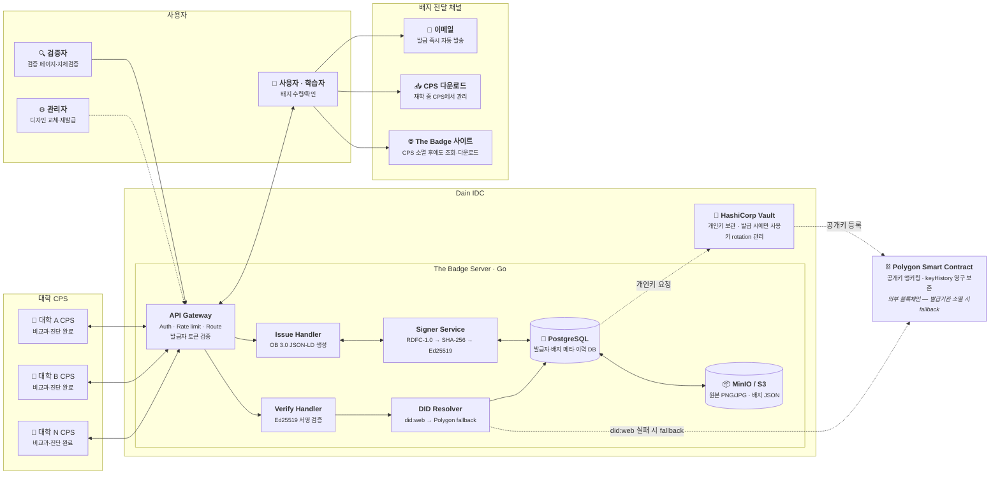
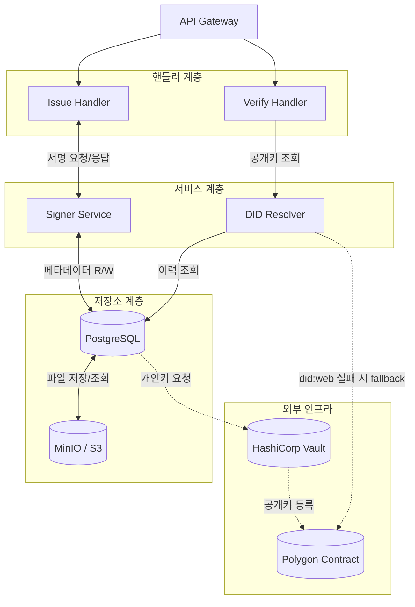
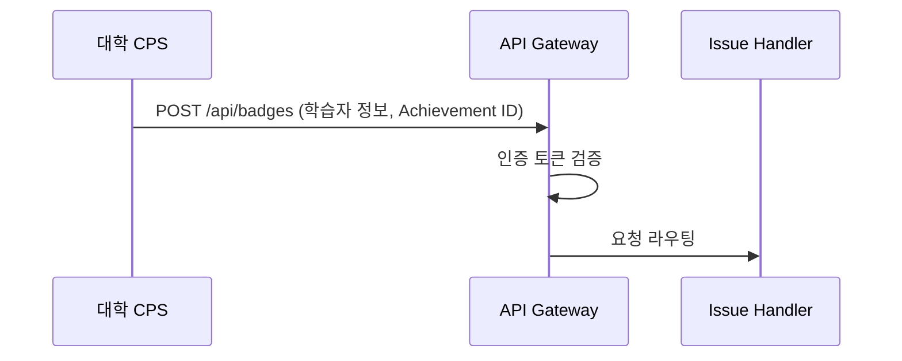
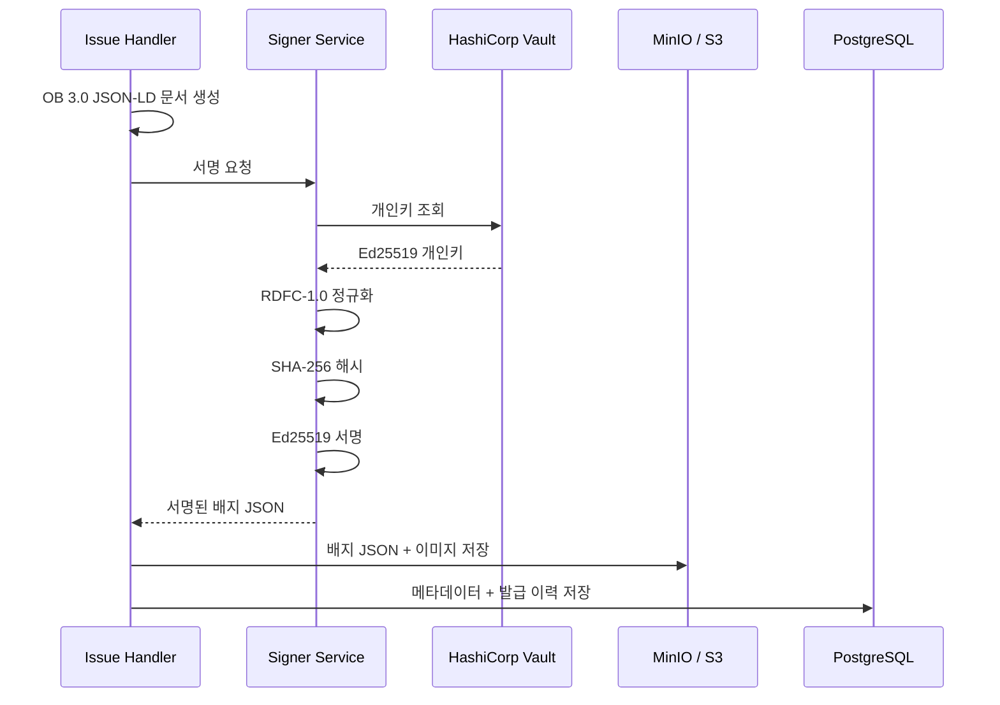
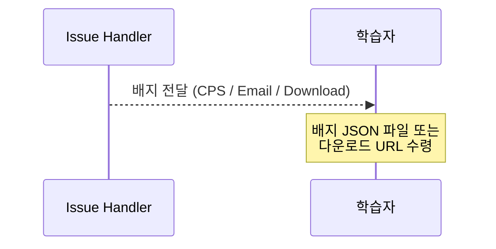
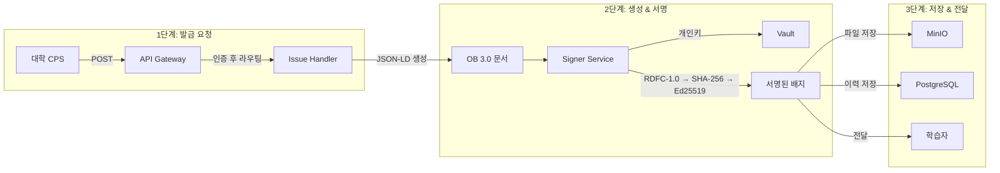

# 시스템 아키텍처

The Badge 서버는 다인리더스가 운영하는 **중앙 배지 발급 서버**로, 여러 대학의 CPS(Campus Portal System)로부터 배지 발급 요청을 받아 처리한다. 사용자는 CPS 내의 마이페이지 또는 The Badge Service에 접근하여 본인이 수령한 배지를 확인할 수 있다.

## 전체 시스템 구성도

> **범례:** 실선 = 주요 데이터 흐름, 점선 = 보조/fallback 흐름

## 주요 구성요소

| 구성요소 | 역할 | 기술 스택 |
|---|---|---|
| **API Gateway** | 인증, 요청 라우팅, Rate Limit 처리 | Go / Fiber Middleware |
| **Issue Handler** | 배지 발급 요청 처리, JSON-LD 생성 | Go |
| **Verify Handler** | 배지 서명 검증 처리 | Go |
| **Signer Service** | Ed25519 서명 생성 (개인키 관리) | Go / `crypto/ed25519` |
| **DID Resolver** | did:web 기반 공개키 조회 | Go |
| **PostgreSQL** | 발급자 정보, 배지 메타데이터, 발급 이력 저장 | PostgreSQL |
| **MinIO / S3** | 배지 JSON 파일, 이미지 파일 저장 및 배포 | MinIO (S3 호환) |

## 내부 컴포넌트 관계도

## 전체 데이터 흐름

시스템의 주요 데이터 흐름은 **세 단계**로 구성된다.

### 1단계: 발급 요청

- 대학 CPS에서 학습자의 비교과 이수 또는 역량 진단 완료 이벤트 발생, 또는 사용자가 The Badge 서비스에 접근하여 요청
- The Badge API로 배지 발급 요청(HTTP POST) 전송
- API Gateway에서 인증 검증 후 Issue Handler로 라우팅

### 2단계: 배지 생성 및 서명

### 3단계: 배지 전달

## 전체 흐름 통합 다이어그램

