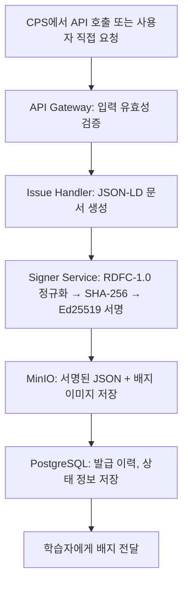
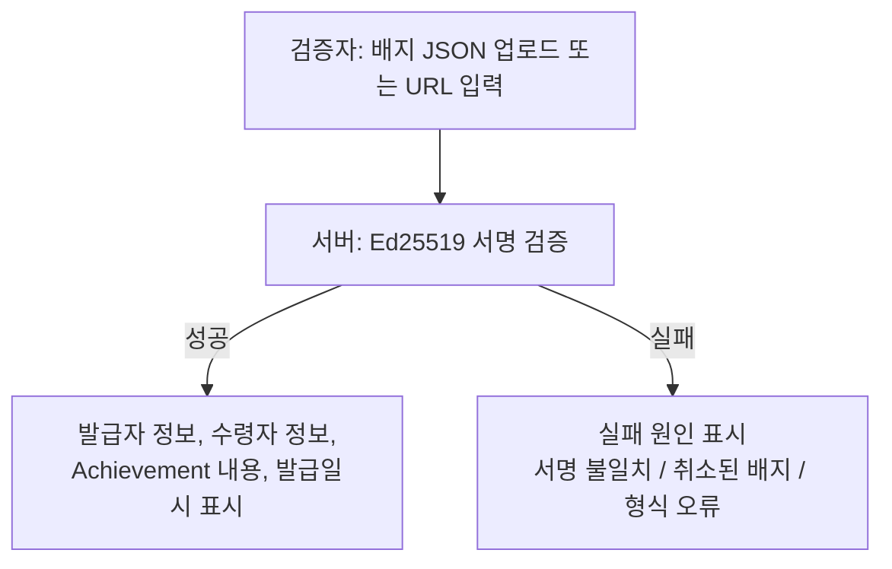
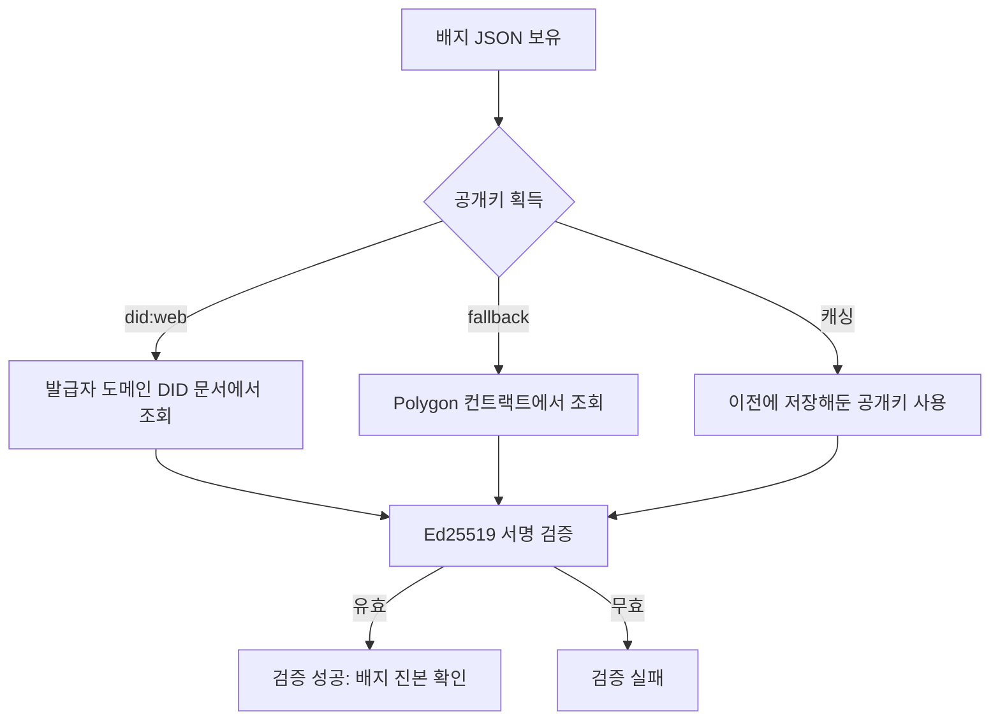
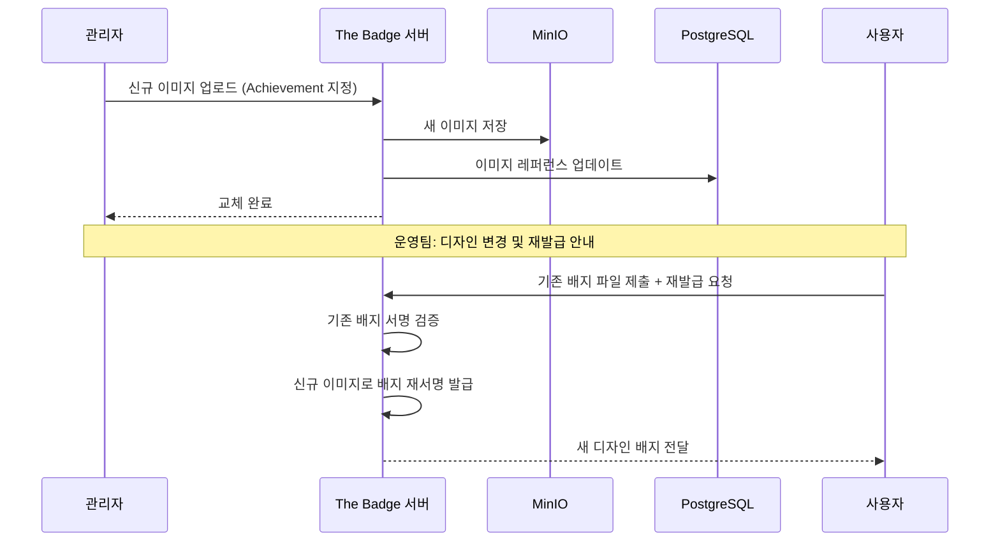

# MVP 배지 프로세스

MVP(Minimum Viable Product) 단계에서는 핵심 세 가지 프로세스를 구현한다: **발급**, **검증**, **디자인 교체**. 각 프로세스는 독립적으로 동작 가능하도록 설계한다.

## 1. 발급 프로세스

발급 프로세스는 사용자가 비교과 이수 또는 역량 진단을 완료한 후, 서명된 배지 파일을 수령하기까지의 전체 흐름을 포함한다.

### 단계별 상세

| 단계 | 설명 | 담당 |
|---|---|---|
| 1. 발급 요청 | CPS에서 API 호출 (학습자 정보, Achievement ID 포함) 또는 사용자가 The Badge 서비스에서 요청 | 대학 CPS / 사용자 |
| 2. 입력 유효성 검증 | 요청 파라미터, 발급자 인증 토큰 검증 | API Gateway |
| 3. JSON-LD 문서 생성 | OB 3.0 `OpenBadgeCredential` 형식으로 배지 데이터 구성 | Issue Handler |
| 4. 정규화 및 서명 | RDFC-1.0 정규화 → SHA-256 → Ed25519 서명 | Signer Service |
| 5. 파일 저장 | 서명된 JSON 및 배지 이미지를 MinIO에 저장 | Issue Handler |
| 6. DB 기록 | 발급 이력, 상태 정보를 PostgreSQL에 저장 | Issue Handler |
| 7. 배지 전달 | 학습자에게 배지 파일 다운로드 링크 또는 JSON 전달 | Issue Handler |

### 배지 파일 형식

| 형식 | 설명 | 비고 |
|---|---|---|
| **JSON 파일** | 서명이 포함된 `OpenBadgeCredential` JSON 직접 전달 | 권장 |
| **Baked 이미지** | PNG 또는 SVG 이미지 파일 내에 JSON-LD를 임베딩하여 전달 | 보조 |

### 이미지 처리 정책

- 배지 이미지는 **base64로 인코딩**하여 JSON 내 `image` 필드에 직접 포함
- 이미지 원본(PNG/JPG)은 관리 및 재처리 목적으로 MinIO에 별도 보관
- base64 embed를 통해 발급기관 서버가 소멸하더라도 배지 JSON 하나로 이미지 포함 전체 정보가 자급자족
- 배지 JSON에는 Polygon 컨트랙트 주소(`didFallback`)를 포함하여 발급기관 소멸 후에도 공개키 조회 및 서명 검증 가능

---

## 2. 검증 프로세스

수령한 배지가 유효한지(위변조되지 않았는지, 취소되지 않았는지)를 확인하는 과정이다. OB 3.0의 핵심 장점은 **공개키만 있으면 오프라인에서도 검증 가능**하다는 점이다.

공개키 조회는 `did:web`을 우선 시도하며, 실패 시 배지 JSON 내 `didFallback`에 명시된 Polygon 스마트컨트랙트에서 fallback 조회한다.

### 2.1 검증 페이지를 통한 검증 (1차 방법)

The Badge 서버가 검증 페이지를 별도로 제공하며, 검증자는 해당 URL에서 배지 파일을 업로드하면 자동으로 검증 결과를 확인할 수 있다.

### 2.2 자체 검증 방법 (2차 방법 — 검증 페이지 미운영 시)

검증 페이지가 폐쇄되거나 서버가 다운된 상황에서도 배지의 유효성을 확인할 수 있는 방법을 제공한다.

### 검증 결과 케이스

| 케이스 | 시나리오 | 검증 결과 |
|---|---|---|
| 성공 | 배지 JSON을 공개키로 서명 검증 → 일치 | 서명 유효, 배지 진본 확인 |
| 실패 1 | 배지 내용이 일부 수정된 경우 → 서명 불일치 | 검증 실패, 위변조 감지 |
| 실패 2 | 취소(Revocation) 목록에 포함된 배지 | 검증 실패, 취소된 배지 |
| 실패 3 | 만료일(`expirationDate`)이 경과한 배지 | 검증 실패, 기간 만료 |

### 공개키 획득 방법

- **did:web 방식**: 발급자 도메인의 DID 문서(`https://example.com/.well-known/did.json`)에서 공개키 조회. 도메인 응답 실패 시 배지 JSON의 `didFallback.contractAddress`를 통해 Polygon 컨트랙트에서 조회(fallback)
- **공개키 캐싱**: 한 번 획득한 공개키를 저장해두면 이후 서버 없이도 검증 가능
- **키 교체 시**: 구 공개키는 Polygon 컨트랙트 `keyHistory`에 `revokedAt` 타임스탬프와 함께 영구 보존. 개인키는 HashiCorp Vault에서 즉시 폐기. 기존 발급 배지는 발급 시점 기준 유효 공개키로 계속 검증 가능

---

## 3. 디자인 교체 프로세스

배지 디자인은 운영 중 변경이 필요할 수 있다. OB 3.0은 배지 데이터(JSON)와 이미지(디자인)를 분리하여 관리하므로, **디자인 교체 시에도 배지의 유효성(서명)은 영향을 받지 않는다**.

### 핵심 원칙

- **기존 배지 유효성 유지**: 사용자가 재발급받지 않더라도 기존 배지는 계속 유효
- **자발적 재발급**: 새 디자인의 배지가 필요한 사용자는 기존 배지 파일을 제출하여 재발급 요청 가능
- **이미지 분리 설계**: 서명 대상 데이터에 이미지 바이너리를 포함하지 않고, base64 참조로 포함

### 디자인 교체 흐름

### 단계별 상세

| 단계 | 설명 | 처리 주체 |
|---|---|---|
| 1. 디자인 교체 요청 | 관리자가 특정 Achievement의 신규 이미지 업로드 | The Badge 관리자 |
| 2. 이미지 갱신 | MinIO에 새 이미지 저장, DB의 이미지 레퍼런스 업데이트 | The Badge 서버 |
| 3. 사용자 공지 | 디자인 변경 안내 및 재발급 안내 (정책 필요) | 운영팀 |
| 4. 재발급 요청 | 사용자가 기존 배지 파일 제출 후 재발급 요청 | 사용자 |
| 5. 재발급 처리 | 기존 배지 서명 검증 후, 신규 이미지가 포함된 배지 재서명 발급 | The Badge 서버 |

### 사용자 알림 방안 (검토 중)

- **이메일 일괄 발송**: 해당 Achievement 보유자 전원에게 변경 안내 이메일 발송
- **CPS 연동 알림**: 원적 대학 CPS에 변경 이벤트를 전달하여 CPS를 통해 알림 처리
- **검증 시 안내**: 검증 페이지에서 구버전 배지 검증 시 '새 버전 배지 재발급 가능' 안내 표시

> **참고:** 디자인 이미지를 base64로 JSON에 직접 포함하는 경우, 디자인 교체 시 이전 배지 JSON의 이미지 데이터는 변경되지 않으므로 서명 검증에는 영향이 없다. 단, 구버전 이미지가 배지 파일 내에 영구적으로 고정되는 특성을 운영 정책에 반영해야 한다.
