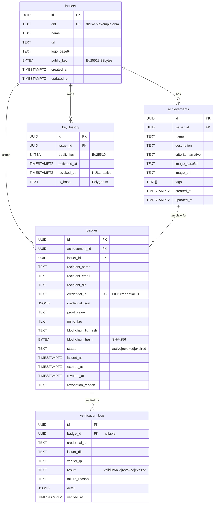

# Database Schema — The Badge Project

001_initial_schema.sql + 002_add_credential_fields.sql 반영 최종 상태.

PostgreSQL 16 / Database: `openbadge`

---

## ERD

---

## 테이블별 컬럼 명세

### 1. issuers (발급 기관)

| 컬럼 | 타입 | NOT NULL | 기본값 | 설명 |
|---|---|---|---|---|
| id | UUID | YES | gen_random_uuid() | PK |
| did | TEXT | YES | — | DID 식별자 (UNIQUE) |
| name | TEXT | YES | — | 기관명 |
| url | TEXT | NO | — | 기관 URL |
| logo_base64 | TEXT | NO | — | 기관 로고 (base64) |
| public_key | BYTEA | YES | — | Ed25519 공개키 (32 bytes) |
| created_at | TIMESTAMPTZ | YES | now() | 생성 시각 |
| updated_at | TIMESTAMPTZ | YES | now() | 수정 시각 |

### 2. achievements (배지 정의/템플릿)

| 컬럼 | 타입 | NOT NULL | 기본값 | 설명 |
|---|---|---|---|---|
| id | UUID | YES | gen_random_uuid() | PK |
| issuer_id | UUID | YES | — | FK → issuers(id) |
| name | TEXT | YES | — | 배지 이름 |
| description | TEXT | YES | — | 배지 설명 |
| criteria_narrative | TEXT | YES | — | 이수 기준 |
| image_base64 | TEXT | NO | — | 배지 이미지 (base64) |
| image_url | TEXT | NO | — | MinIO 원본 이미지 URL |
| tags | TEXT[] | NO | — | 태그 배열 |
| created_at | TIMESTAMPTZ | YES | now() | 생성 시각 |
| updated_at | TIMESTAMPTZ | YES | now() | 수정 시각 |

### 3. badges (발급된 배지)

| 컬럼 | 타입 | NOT NULL | 기본값 | 설명 |
|---|---|---|---|---|
| id | UUID | YES | gen_random_uuid() | PK |
| achievement_id | UUID | YES | — | FK → achievements(id) |
| issuer_id | UUID | YES | — | FK → issuers(id) |
| recipient_name | TEXT | YES | — | 수령자 이름 |
| recipient_email | TEXT | YES | — | 수령자 이메일 |
| recipient_did | TEXT | NO | — | 수령자 DID |
| credential_id | TEXT | NO | — | OB 3.0 credential ID (UNIQUE) |
| credential_json | JSONB | YES | — | 서명된 OB 3.0 JSON 전체 |
| proof_value | TEXT | YES | — | Ed25519 서명값 (base64) |
| minio_key | TEXT | NO | — | MinIO 저장 키 |
| blockchain_tx_hash | TEXT | NO | — | Polygon 트랜잭션 해시 |
| blockchain_hash | BYTEA | NO | — | credential JSON SHA-256 해시 |
| status | TEXT | YES | 'active' | CHECK: active, revoked, expired |
| issued_at | TIMESTAMPTZ | YES | now() | 발급 시각 |
| expires_at | TIMESTAMPTZ | NO | — | 만료일 |
| revoked_at | TIMESTAMPTZ | NO | — | 취소일 |
| revocation_reason | TEXT | NO | — | 취소 사유 |

### 4. verification_logs (검증 이력)

| 컬럼 | 타입 | NOT NULL | 기본값 | 설명 |
|---|---|---|---|---|
| id | UUID | YES | gen_random_uuid() | PK |
| badge_id | UUID | NO | — | FK → badges(id), nullable (외부 검증) |
| credential_id | TEXT | NO | — | OB 3.0 credential ID |
| issuer_did | TEXT | NO | — | 검증 대상 발급자 DID |
| verifier_ip | TEXT | NO | — | 검증자 IP (해시 처리) |
| result | TEXT | YES | — | CHECK: valid, invalid, revoked, expired |
| failure_reason | TEXT | NO | — | 실패 사유 |
| detail | JSONB | NO | — | 검증 상세 결과 (다단계 검증 정보) |
| verified_at | TIMESTAMPTZ | YES | now() | 검증 시각 |

### 5. key_history (키 교체 이력)

| 컬럼 | 타입 | NOT NULL | 기본값 | 설명 |
|---|---|---|---|---|
| id | UUID | YES | gen_random_uuid() | PK |
| issuer_id | UUID | YES | — | FK → issuers(id) |
| public_key | BYTEA | YES | — | Ed25519 공개키 |
| activated_at | TIMESTAMPTZ | YES | now() | 활성화 시각 |
| revoked_at | TIMESTAMPTZ | NO | — | 폐기 시각 (NULL = 현재 활성) |
| tx_hash | TEXT | NO | — | Polygon 트랜잭션 해시 |

---

## 인덱스 목록

| 인덱스명 | 테이블 | 컬럼 | 유형 | 마이그레이션 |
|---|---|---|---|---|
| issuers_pkey | issuers | id | PK (UNIQUE) | 001 |
| issuers_did_key | issuers | did | UNIQUE | 001 |
| achievements_pkey | achievements | id | PK (UNIQUE) | 001 |
| badges_pkey | badges | id | PK (UNIQUE) | 001 |
| idx_badges_recipient_email | badges | recipient_email | INDEX | 001 |
| idx_badges_achievement_id | badges | achievement_id | INDEX | 001 |
| idx_badges_status | badges | status | INDEX | 001 |
| badges_credential_id_key | badges | credential_id | UNIQUE | 002 |
| idx_badges_credential_id | badges | credential_id | INDEX | 002 |
| verification_logs_pkey | verification_logs | id | PK (UNIQUE) | 001 |
| idx_verification_logs_badge_id | verification_logs | badge_id | INDEX | 001 |
| key_history_pkey | key_history | id | PK (UNIQUE) | 001 |
| idx_key_history_issuer_id | key_history | issuer_id | INDEX | 001 |

---

## 외래키 관계

| 소스 테이블 | 소스 컬럼 | 대상 테이블 | 대상 컬럼 | ON DELETE |
|---|---|---|---|---|
| achievements | issuer_id | issuers | id | (기본: NO ACTION) |
| badges | achievement_id | achievements | id | (기본: NO ACTION) |
| badges | issuer_id | issuers | id | (기본: NO ACTION) |
| verification_logs | badge_id | badges | id | (기본: NO ACTION) |
| key_history | issuer_id | issuers | id | (기본: NO ACTION) |

---

## CHECK 제약 조건

| 테이블 | 컬럼 | 허용 값 |
|---|---|---|
| badges | status | `'active'`, `'revoked'`, `'expired'` |
| verification_logs | result | `'valid'`, `'invalid'`, `'revoked'`, `'expired'` |
