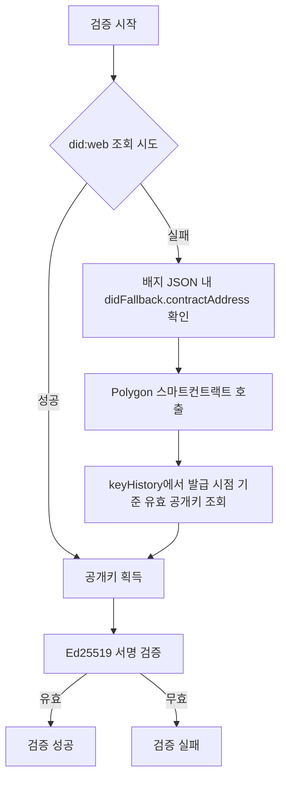
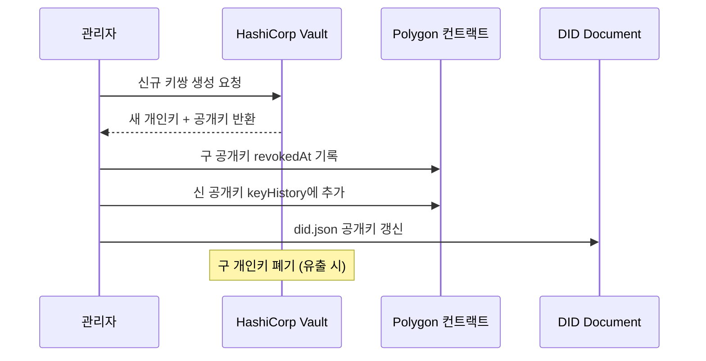

# DID(Decentralized Identifier) 설계

DID(Decentralized Identifier)는 발급기관을 식별하는 탈중앙화 식별자로, 배지 검증 시 발급자의 공개키를 조회하는 기준점이 된다. The Badge 시스템은 **did:web** 방식을 채택하며, 발급기관 소멸에 대비하여 Polygon 스마트컨트랙트를 fallback으로 활용한다.

## did:web vs did:key 비교

OB 3.0 발급 시스템에서 DID 방식 선택은 키 관리 정책과 장기 검증 가능성에 직결된다.

| 구분 | did:web | did:key |
|---|---|---|
| **공개키 위치** | 도메인 서버 (`/.well-known/did.json`) | DID 문자열 자체에 인코딩 |
| **외부 서버 의존** | 있음 (도메인 생존 필요) → Polygon fallback으로 보완 | 없음 (완전 오프라인 검증 가능) |
| **키 교체(rotation)** | 가능 (`keyHistory`로 이력 관리) | 불가 (DID 자체가 키이므로 교체 시 DID 변경) |
| **개인키 관리** | HashiCorp Vault (별도 보관, 발급 시에만 사용) | HashiCorp Vault (동일) |
| **블록체인 연동** | Polygon 컨트랙트에 공개키 앵커링 (`keyHistory` 보존) | 불필요 (키가 DID에 내장) → 컨트랙트 활용 의미 없음 |
| **The Badge 채택** | **채택** (Polygon 앵커링으로 단점 보완) | 미채택 (키 rotation 불가, 컨트랙트 연동 불가) |

## 공개키 조회 흐름 (did:web + Polygon fallback)

검증자는 다음 순서로 공개키를 조회한다.

> 발급기관이 소멸하더라도 Polygon 컨트랙트가 살아있는 한 **영구 검증이 보장**된다.

## 키 교체(Rotation) 정책

- **개인키(Private Key)**: 배지 서명 시에만 사용하며 HashiCorp Vault에서 관리
- **공개키(Public Key)**: Polygon 컨트랙트의 `keyHistory`에 등록되어 누구나 조회 가능

### 키 교체 트리거

1. 정기 교체 (보안 정책)
2. 개인키 유출 의심
3. 담당자 변경

### 시나리오별 처리 방식

| 시나리오 | 처리 방식 | 기존 배지 영향 |
|---|---|---|
| **정기 교체** | 구 공개키 `revokedAt` 기록 후 `keyHistory` 보존. 신 키쌍 생성 및 Vault 등록. 신 공개키 Polygon 등록 | 영향 없음. 발급 시점 기준 구 공개키로 계속 검증 가능 |
| **개인키 유출 의심** | Vault에서 개인키 즉시 폐기(완전 삭제). 구 공개키 revoke. 신 키쌍 생성 및 등록 | 재발급 권고 (배지 위조 가능성으로 신뢰성 훼손 위험) |
| **담당자 변경** | 정기 교체 절차와 동일. Vault 접근 권한 이전 처리 병행 | 영향 없음 |

