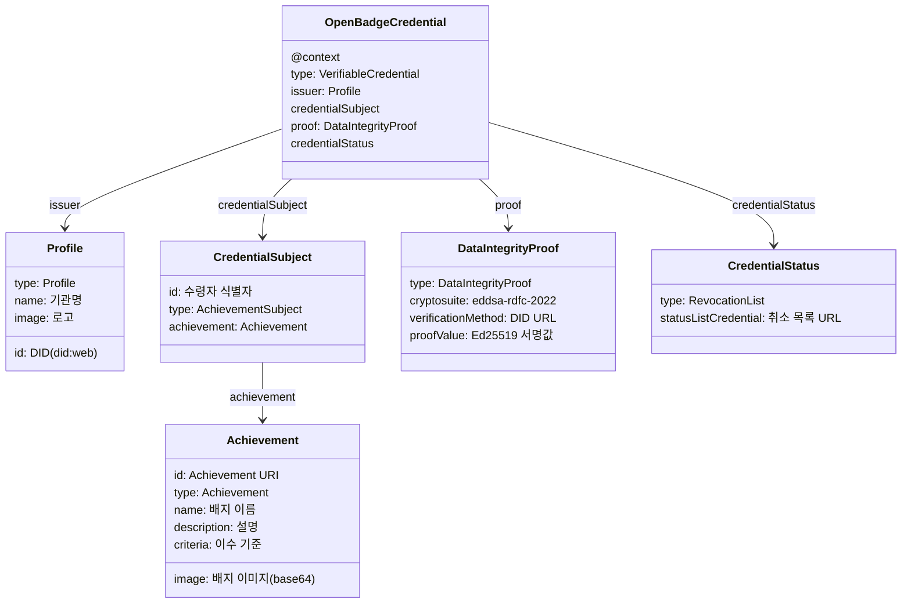

# OB 3.0 핵심 오브젝트 구조 및 참고 자료

## 핵심 오브젝트 구조

발급되는 배지(`OpenBadgeCredential`)의 주요 오브젝트 구조는 다음과 같다.

### 오브젝트 설명

| 오브젝트 | 설명 |
|---|---|
| **OpenBadgeCredential** | 발급된 배지 전체. W3C `VerifiableCredential` 기반 |
| **issuer (Profile)** | 발급 기관 정보. DID(`did:web`), 기관명, 로고 포함 |
| **credentialSubject** | 배지 수령자 정보 및 Achievement 참조 |
| **Achievement** | 배지 정의. 이름, 설명, 이수 기준(Criteria), 이미지 |
| **proof (DataIntegrityProof)** | Ed25519 서명값 및 서명 메타데이터 |
| **credentialStatus** | 배지 취소(Revocation) 상태 관리 엔드포인트 참조 |

## 서명 방식

> 1EdTech OB 3.0 표준은 **JWT+RS256** 방식과 **DataIntegrityProof+Ed25519(eddsa-rdfc-2022)** 방식 중 하나만 구현해도 인증 획득이 가능하다.
>
> **The Badge 시스템은 DataIntegrityProof + eddsa-rdfc-2022 방식을 채택한다.**

| 방식 | 알고리즘 | The Badge 채택 |
|---|---|---|
| Linked Data Proof | `eddsa-rdfc-2022` (Ed25519) | **채택** |
| JWT | RS256 (RSA) + JWK | 미채택 |

---

## 참고 문서 및 외부 링크

### OB 3.0 핵심 스펙 문서 (1EdTech)

- [OB 3.0 메인 스펙](https://www.imsglobal.org/spec/ob/v3p0) — proof 섹션, Baking, API 정의 포함
- [OB 3.0 Implementation Guide](https://www.imsglobal.org/spec/ob/v3p0/impl) — 서명 방식 선택, 키 관리, 발급 단계별 가이드
- [OB 3.0 Certification Guide](https://www.imsglobal.org/spec/ob/v3p0/cert) — eddsa-rdfc-2022 필수 명시, 인증 절차

### 서명 알고리즘 스펙 (W3C)

- [Data Integrity EdDSA Cryptosuites v1.0](https://www.w3.org/TR/vc-di-eddsa/) — eddsa-rdfc-2022 알고리즘 정식 W3C 스펙
- [W3C Verifiable Credentials Data Model v2.0](https://www.w3.org/TR/vc-data-model-2.0/) — OB 3.0이 기반하는 상위 VC 표준

### 1EdTech 공식 페이지 및 GitHub

- [1EdTech Open Badges 표준 소개](https://www.1edtech.org/standards/open-badges)
- [OB 스펙 GitHub 레포](https://github.com/1EdTech/openbadges-specification) (1EdTech 공식)

### JSON-LD Context 파일

배지 JSON 작성 시 직접 참조하는 context 파일:

- [W3C VC Context v2](https://www.w3.org/ns/credentials/v2)
- [OB 3.0 JSON-LD Context](https://purl.imsglobal.org/spec/ob/v3p0/context-3.0.3.json) — 배지 JSON의 `@context`에 직접 사용

> **참고:** OB 3.0 Certification Guide 기준 — Linked Data Proof 방식을 선택한 발급자는 `eddsa-rdfc-2022` (Data Integrity EdDSA Cryptosuites v1.0)를 반드시 사용해야 하며, JWT 방식을 선택한 발급자는 RSA256 키와 JWK 형식을 사용해야 한다. 두 방식 중 하나만 구현하면 1EdTech 인증 획득이 가능하다.
